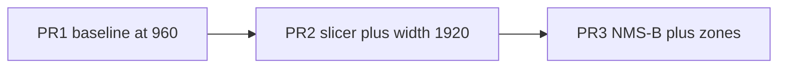

# Plan: medición → InferenceSlicer → NMS/zonas (3 PRs)

## Fuentes de verdad (APIs, no inventar)

- [InferenceSlicer](https://supervision.roboflow.com/latest/detection/tools/inference_slicer/) — `slice_wh` / `overlap_wh` px; `thread_workers` default 1; callback sync → `Detections`; merge + `with_nms(threshold, overlap_metric)` **sin** `class_agnostic` → default `False` → **exige `class_id` + `confidence`**. `move_detections` deja cajas en **coords del frame completo** (hires si el slicer corre sobre hires).
- [Detections.with_nms](https://supervision.roboflow.com/latest/detection/core/) — `class_agnostic=False` por defecto; `overlap_metric` IOU|IOS (**nunca IOS** en VI).
- [PolygonZone](https://supervision.roboflow.com/latest/detection/tools/polygon_zone/) — `polygon` **(N,2) px absolutos**; mask dimensionada por **extent del polígono** (`x_max+2, y_max+2`), no por el frame; `trigger` usa anchors de `xyxy` (default `BOTTOM_CENTER`). Foto one-shot: **no** ByteTrack.
- **No usar** `denormalize_boxes` para polígonos: esa API espera **xyxy**, no `(N,2)`. Denorm de zona = **`pts * [w, h]`** únicamente.
- OpenCV: bridge pinnea `opencv-python-headless==4.10.0.84`. `supervision==0.28.0` declara **`opencv-python>=4.5.5.64`** (no headless) — conflicto real; resolver en PR2 antes del merge (ver abajo).
- CLAHE/deskew **fuera** de estos PRs.

## Principio

Cada PR es reversible y medible. CLAHE y deskew **no entran**. Dos capas de NMS (A tile / B cross-cap) y **dos mapas de `class_id`** documentados por separado.



---

## PR1 — Medición + wording (cero cambio del **código** de inferencia)

**Objetivo:** baseline atribuible al estado **actual** (`BRIDGE_MAX_WIDTH` default **960**) y el número que fija `slice_wh` en PR2. El path de inferencia del bridge **no** cambia.

### Decisiones fijadas
- **No** subir `BRIDGE_MAX_WIDTH` en PR1. El default sigue **960** en [`detection/common/geometry.py`](detection/common/geometry.py), [`.env.example`](.env.example), [`docker-compose.yml`](docker-compose.yml). PR1 solo reescribe el **comentario** que explica el 960 (foto one-shot / OOM opcional), no el número. Prohibido “aprovechar” el wording para meter 1920.
- Wording “CPU saturada / 640” → foto one-shot + OOM opcional en [`.env.example`](.env.example) e [`infra/README.md`](infra/README.md). Las negaciones útiles (“No abre RTSP…”) en [`bridge/main.py`](bridge/main.py) / [`bridge/README.md`](bridge/README.md) **se quedan**.
- `BRIDGE_FPS` / `DEMO_MODE` se mantienen.
- Baseline de medición = **960**, sin excepción (atribuible para PR2).

### Medición (obligatoria)
1. **Input efectivo PaddleX (vehicles + objects):** medir tamaño del JPEG tras `maybe_resize_for_infer` y, si la respuesta expone imagen, el tamaño decodificado (hipótesis ~640 interna — **no asumir**). Resultado = candidato **`INFER_SLICE_WH`**.
2. **Histograma de anchos de bbox** sobre GT `--packs core`.
3. **Harness bridge-side:** `--via-bridge-preprocess` con el resize actual del bridge (sin tiles). Cableado para que PR2 enchufe el mismo núcleo sync.
4. **Contador en `parse_plate`:** totales / rechazados regex / aceptados.

### Exit criteria PR1
Baseline Core (direct + via-bridge-resize a **960**); `INFER_SLICE_WH` propuesto; wording limpio; **default sigue 960**.

---

## PR2 — `sv.InferenceSlicer` + invariante de coordenadas + default 1920

**Objetivo:** resolución efectiva constante por tile en vehicles/objects, medible vs baseline PR1 (960), sin OOM ni doble escalado.

### Default de ancho (aquí, no en PR1)
- `BRIDGE_MAX_WIDTH` default **960 → 1920** en geometry / `.env.example` / compose.
- Con slicer, el ancho del bridge **deja de gobernar** la resolución de detección tileada (pasa a `INFER_SLICE_WH`). `BRIDGE_MAX_WIDTH` queda para caps **no** tileadas. El costo RAM de 8 GB se evalúa **junto** al tiling.

### Invariante de coordenadas (obligatorio — bug silencioso si falta)
Hoy [`bridge/main.py`](bridge/main.py) `run_detections` escala vehicles/objects (y peats/`extend_scaled`) tras el gather. El slicer ya devuelve **hires** vía `move_detections`. Si esas `scale_detections` quedan sobre cajas tileadas, los boxes se **inflan** otra vez: no crashea; `merge_coco_detections` deja de dedupear (IoU nunca > 0.5 → cada auto dos veces); `merge_person_attributes` falla en silencio.

**Regla:** cada capacidad entrega cajas en **coords hires antes de salir de su rama**.
- Tileada (vehicles/objects con slicer): el slicer ya trasladó → **no** re-escalar.
- No tileada: su rama aplica `scale_detections` con el `scale_*` de `maybe_resize_for_infer` → luego sale en hires.
- `run_detections` **deja de escalar de forma global**. Los merges solo ven hires.

**Test anti-regresión:** mismo fixture con tiling on y off; boxes de vehicles dentro de tolerancia chica (detecta doble escalado).

### Núcleo sync compartido (no wrapper async)
Unidad compartida bridge ↔ harness:

```text
infer_tiled_sync(frame_hires, base_url, predict_path, *, slice_wh, overlap_wh, ...) -> list[dict]
```

- Contiene: `InferenceSlicer` + callback con `httpx.Client` sync + conversión a dicts VI (aún **sin** `track_id` string; eso post-slicer).
- **`asyncio.to_thread` solo en** [`bridge/main.py`](bridge/main.py).
- Harness host-side **llama el sync directo** — no duplicar slicer en `scripts/`, no meter asyncio en el harness.

### Por qué no tiler a mano
Usar `sv.InferenceSlicer`. Dep `supervision==0.28.0` (o 0.28.x pinneada) en [`bridge/requirements.txt`](bridge/requirements.txt) **desde PR2**.

### Conflicto OpenCV (bloqueante de merge PR2)
`supervision 0.28.0` → `requires_dist: opencv-python>=4.5.5.64`. Bridge → `opencv-python-headless==4.10.0.84`.

Antes de merge: `pip install --dry-run` (o resolve en imagen bridge) y **dejar solo headless** (constraint/`opencv-python` → headless, o reinstall forzado documentado). No descubrirlo en el build de Docker Desktop.

### Parametrización
| Env | Significado |
|-----|-------------|
| `INFER_SLICE_WH` | Tile en px; default = medido en PR1 |
| `INFER_OVERLAP_WH` | Solape en px (`< slice_wh`) |
| `ENABLE_INFER_TILING` | Feature flag |
| `INFER_TILE_THREAD_WORKERS` | Default **1** |

Slicer sobre **frame_hires**. Caps no tileadas: JPEG `frame_infer` + scale en su rama.

### `class_id` capa A — nombre explícito
Función **`class_id_for_tile_nms(...)`** (mapa label→id **dentro de la capacidad**). Solo para el NMS interno del slicer. **No** reutilizar en PR3.

### NMS capa A
`overlap_filter=NON_MAX_SUPPRESSION`, `overlap_metric=IOU`, `thread_workers=1`.
Implementado en [`detection/common/tiled_infer.py`](detection/common/tiled_infer.py)
(`infer_tiled_sync` + `class_id_for_tile_nms`). Documentar vs capa B.

### Exit criteria PR2
Core bridge-tiles ≥ baseline PR1 (960); test tiling on/off OK; dry-run deps sin `opencv-python` GUI duplicado; harness usa sync core; doc NMS-A; default ancho 1920.

---

## PR3 — NMS cross-cap (capa B) + zonas

### Dos espacios de `class_id` (no reusar el de PR2)
- **`class_id_for_tile_nms`** (PR2): numeración intra-capacidad (car vs truck, etc.).
- **`class_id_for_cross_cap_nms`**: mapa de **`entity_type`** (vehicle vs face vs object…).

Antes del NMS-B: **remapear** siempre con `class_id_for_cross_cap_nms`. Si se reusa el de PR2, la capa B compara taxonomía COCO en vez de entidad y el resultado es “plausible pero incorrecto”.

### NMS-B — resto
- `class_agnostic=False`; **`overlap_metric=IOU`** (nunca IOS).
- Excluir `append_one` sin bbox.
- `track_id` string VI en **`data`**, no en `tracker_id` numérico.
- Normalizar keys de `data` antes de `Detections.merge`.
- Survivor = mayor score; extras solo del survivor.
- Doc capa A vs B.

### Zonas
- Config [0,1]; runtime **`pts * [w, h]`** → `PolygonZone(polygon=abs int64)`. **Prohibido** `denormalize_boxes` para polígonos.
- `trigger` sin ByteTrack.
- Tag `zones` → epp **opcional aditivo**; **`SCHEMA_VERSION` permanece `"1.0"`** (backward-compatible: cliente viejo ignora `zones`). Bump solo si rules-sink **exige** presencia de `zones`.
- `gen_epp_types` + rules `zone:no_parking`.
- Preview: contorno (`PolygonZoneAnnotator` / `draw_polygon`).

### Tests PR3
- face+person sobreviven; objects duplicados se dedupean; survivor conserva `track_id`/`plate` en `data`.
- Keys `data` heterogéneas tras normalizar.
- Zona hit/miss en dos tamaños de frame.
- **Anchor fuera del extent del polígono → miss** (mask no cubre el frame; clipping no debe dar falso positivo).
- Remap: NMS-B usa `class_id_for_cross_cap_nms`, no el class_id de tile.

### Exit criteria PR3
NMS-B no borra anidados; zones bridge → epp → rules; tipos TS regenerados; tests de extent + remap verdes.

---

## Fuera de estos tres PRs
- CLAHE; deskew; borrar small_objects; tiling extended; UI polígonos; `run_coroutine_threadsafe`.

---

## Orden de merge
1. PR1 → baseline a **960** + `INFER_SLICE_WH` propuesto (sin cambiar default de ancho).
2. PR2 → sync core + invariante hires + deps OpenCV + default **1920** + harness tiles.
3. PR3 → remap class_id + NMS-B + zonas (SCHEMA 1.0 aditivo).
